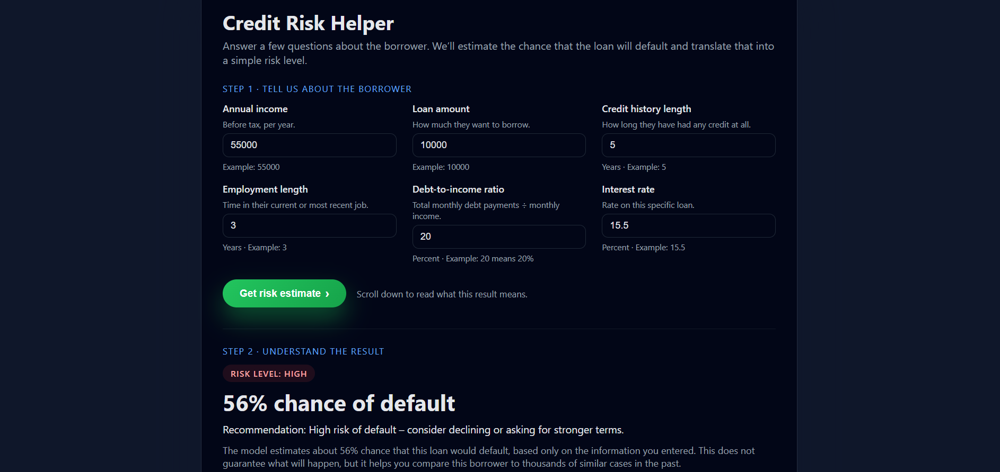

# Credit Risk Pipeline

<p align="center">
  
</p>

End-to-end credit risk prediction system that estimates the probability a borrower will default on a loan.

This project demonstrates how raw financial lending data can be transformed into a machine learning model and deployed as a prediction service through a web API and simple web interface.

---

## Project Overview

This system simulates a simplified credit risk workflow used in financial technology platforms. It processes historical lending data, trains a classification model, and exposes predictions through an API.

Users can input borrower information and receive:

* Probability of default
* Risk classification (Low / Medium / High)
* A recommendation based on predicted risk

The goal of this project was to explore **AI-assisted development and prompt engineering** while building a practical data pipeline and machine learning inference service.

---

## System Architecture

```
Historical Lending Data (CSV)
        │
        ▼
Data Pipeline
- Data ingestion
- Data cleaning
- Feature engineering
        │
        ▼
Model Training
- Scikit-learn pipeline
- StandardScaler
- Logistic Regression
- ROC-AUC evaluation
        │
        ▼
Saved Model Artifact
models/credit_risk_model.joblib
        │
        ▼
Prediction API
FastAPI endpoint: /predict
        │
        ▼
Web UI
HTML + JavaScript interface
```

---

## Tech Stack

### Language

* Python

### Data / Machine Learning

* pandas
* numpy
* scikit-learn

### API / Backend

* FastAPI
* Pydantic
* Uvicorn

### Deployment / Packaging

* Docker
* Joblib (model serialization)

---

## How to Run the Project

This project uses **FastAPI** as the backend server.

Because the UI relies on a running API, **VS Code Live Server will not work**. The Python server must be started.

### 1. Install dependencies

```bash
pip install -r requirements.txt
```

### 2. Train the model (once)

```bash
python -m src.train
```

### 3. Start the web app

From the project root:

```bash
python run_app.py
```

Or run directly with uvicorn:

```bash
uvicorn api.main:app --reload --host 0.0.0.0 --port 8000
```

### 4. Open the application

Open your browser and go to:

```
http://127.0.0.1:8000/
```

You should see the Credit Risk Helper form. Submitting it will call the API and display the predicted risk.

---

## Optional: Run from VS Code

Use **Run and Debug (F5)** with the provided FastAPI launch configuration. This will start the server in the integrated terminal so you can open the application in your browser.

---

## Development Workflow

This project was developed using an **AI-assisted workflow** with structured prompt engineering.

Large components of the system (data pipeline, model training workflow, API structure, and UI behavior) were iteratively designed through prompt-driven collaboration and then reviewed and refined manually.

The goal was to explore how AI tools can accelerate development of scalable data systems while maintaining engineering oversight and architectural understanding.

---

## Future Improvements

Planned enhancements include:

* Interactive risk visualizations and dashboard-style UI
* Model explainability using SHAP feature importance
* Portfolio batch scoring for CSV uploads
* Borrower benchmarking against historical lending data
* Loan eligibility simulation ("what-if" analysis)
* Expanded model metrics dashboard (ROC, confusion matrix, precision/recall)

---

## Disclaimer

This project is intended for educational and demonstration purposes only.

The predictions generated by the model are based on historical lending data and should be interpreted as **decision-support estimates rather than guaranteed financial outcomes**.
